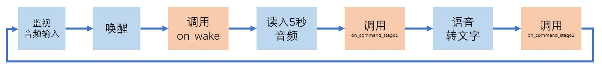
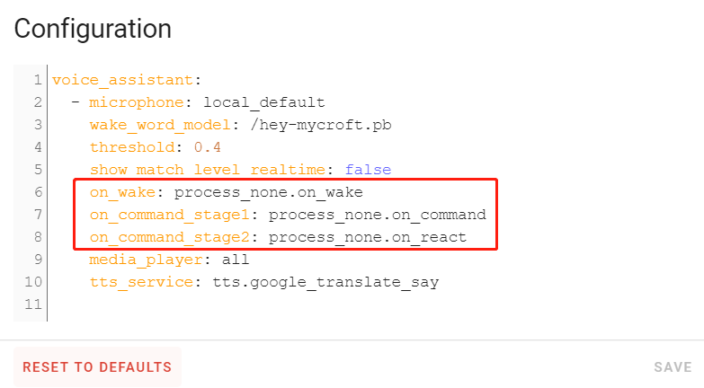

# hassio下的智能音箱DIY

## （1）快速实践

#### 准备工作

- 麦克风
    + USB口的麦克风
    + 远程麦克风

- hassio环境
    + 树莓派下推荐使用hachina的hassos镜像
    
        下载地址：https://pan.baidu.com/s/1INCX_0wkHnGdzJIBJyRuHQ （提取码1024）

        注：在此镜像中，下面的软件都已经事先安装好了。

    + 其它的硬件平台和操作系统平台下的hassio也都可以

#### 非hachina的hassos镜像需要额外准备的内容

- HomeAssistant中可播放音频的媒体播放器
    + 推荐使用[PulseAudio](https://github.com/zhujisheng/HAComponent/tree/master/pulseaudio)
    + 其它媒体播放器，比如`vlc_telnet`、`kodi`、`mpd`都可以

- HomeAssistant中的tts

    + 推荐使用[改装过的tts.google_translate](https://github.com/zhujisheng/Home-Assistant-DIY/tree/master/hassos_image#%E8%A7%A3%E5%86%B3%E5%8D%87%E7%BA%A7homeassistant%E5%90%8Egoogle_translate-tts%E4%B8%8D%E5%8F%AF%E7%94%A8%E7%9A%84%E9%97%AE%E9%A2%98)

    + 也可以使用[tts.baidu](https://www.home-assistant.io/integrations/baidu/)

- add-on `Samba share`

    + 用于方便读写自定义的一些程序与文件

- add-on `voice assistant`

    + 增加仓库：`https://github.com/zhujisheng/hassio-addons`

#### 初次运行

- 检查
    + 麦克风是否已经出现
    + 媒体播放器是否可以读出文字

- 运行中可能的问题

    - 日志中显示唤醒与执行，但并没有“叮”“咚”声

      重启HomeAssistant

    - 误唤醒或漏唤醒

      将配置`show_match_level_realtime`改成`true`后启动


## （2）远程麦克风

#### 硬件

- 麦克风板

  

- nodemcu 32s

  

[淘宝购买地址](https://item.taobao.com/item.htm?spm=a230r.7195193.1997079397.8.170153beCm25K3&id=592861974901&abbucket=1)

#### 程序烧写

- 安装addon: ESPHome
- 配置与烧写
    + 配置

    ```yaml
    esphome:
      name: distributed_microphone
      platform: ESP32
      board: nodemcu-32s
      includes:
        - distributed_microphone.h

    #################......

    switch:
      - platform: custom
        lambda: |-
          auto my_custom_switch = new MicrophoneSwitch();
          App.register_component(my_custom_switch);
          return {my_custom_switch};
        switches:
          name: "RemoteMic"

    # a LED on GPIO17, optional for indicating microphone's state
    output:
      - platform: ledc
        id: mic_led
        pin: GPIO17

    light:
      - platform: monochromatic
        name: "MicLight"
        output: mic_led
        default_transition_length: 0s
        effects:
          - strobe:
    ```

    + [distributed_microphone.h](https://github.com/zhujisheng/audio-reactive-led-strip/blob/master/DistributedMicrophone/distributed_microphone.h)

#### 远程麦克风使用

配置`microphone: 'ip:端口号'`

#### 接入HomeAssistant

- 开关：控制远程麦克风是否拾音
- 灯：`clk`引脚的电平

  

## （3）自定义智能处理过程(1)-提示音与信号灯

#### 智能处理过程



#### 自定义



对应的python程序位于`/share/voice_assistant/`目录下。

#### ha_api

[ha_api调用](https://github.com/zhujisheng/hassio-addons/blob/master/voice_assistant/DOCS.md#ha_apipy)

#### 样例演示

- 使用`收到`，替换声音`咚`
- 使用远程麦克风的指示灯效果，替换提示音

## （4）制作自己的唤醒词

[mycroft precise项目](https://github.com/mycroftai/mycroft-precise)

*[制作自己的关键词](https://github.com/MycroftAI/mycroft-precise/wiki/Training-your-own-wake-word)，官方支持的是linux系统*

#### 初始安装

- 克隆源代码

  `git clone https://github.com/mycroftai/mycroft-precise`

- 安装必要的基础软件

  `sudo apt-get install python3-pip libopenblas-dev python3-scipy cython libhdf5-dev python3-h5py portaudio19-dev`

- 安装

  `cd mycroft-precise`

  `./setup.sh`

#### 初始训练

- 进入运行环境

  `cd mycroft-precise`

  `source .venv/bin/activate`

- 录音

  `precise-collect`

- 构建音频文件存放目录

  ```
  mkdir -p xxxx/wake-word
  mkdir -p xxxx/not-wake-word
  mkdir -p xxxx/test/wake-word
  mkdir -p xxxx/test/not-wake-word
  ```

  将录音获得的文件，放置在对应的目录中。

- 初始训练

  `precise-train -e 60 xxxx.net xxxx/`

  注：如果碰到hdf5库报错`TypeError: a bytes-like object is required, not 'str'`，可以安装低版本hdf5（`pip install h5py==2.10.0`）

#### 测试

- 实时匹配

  `precise-listen xxxx.net`

#### 降低误判率（1）

- 非唤醒词收集

  `precise-listen xxxx.net -d xxxx/not-wake-word`

- 重新训练

  `precise-train xxxx.net xxxx/ -e 600`

#### 降低误判率（2）

- 获得噪音文件

  `mkdir -p data/random`

  `cd data/random`

  `wget http://downloads.tuxfamily.org/pdsounds/pdsounds_march2009.7z`

  `sudo apt-get install p7zip`

  `p7zip -d pdsounds_march2009.7z`

  `cd ../..`

- 转换格式

  ```
  SOURCE_DIR=data/random/mp3
  DEST_DIR=data/random

  for i in $SOURCE_DIR/*.mp3; do echo "Converting $i..."; fn=${i##*/}; ffmpeg -i "$i" -acodec pcm_s16le -ar 16000 -ac 1 -f wav "$DEST_DIR/${fn%.*}.wav"; done
  ```

- 训练

  `precise-train-incremental xxxx.net xxxx/ -r data/random/`

#### 一般训练原则

- 正确发音不能被匹配时，就增加正确样本的量，放置在wake-word目录中；
- 当错误发音被匹配时，就将错误发音添加到not-wake-word目录中
- 如果训练过程中，准确率陷入某个较低的瓶颈值，就将所有生成的模型文件删除（不删除声音样本），然后重新训练

#### 模型转换

`precise-convert xxxx.net`

#### 在voice_assistant中配置

- 将模型文件放置在`/share/voice_assistant`目录中
- 配置

  `wake_word_model: /share/voice_assistant/xxxx.pb`

## （5）自定义智能处理过程(2)-字符串匹配、机器人API


#### `on_command_stage2`函数

参数：

`speech_in`: 语音命令字符串

`va_config`: voice_assistant配置内容


```python
'''
缺省配置中，on_command_stage2指向的process_none.py文件中的的on_react函数
'''
def on_react( speech_in, va_config ):
  """获得语音命令文本后的处理函数"""
  speech_out = f"你对我说，{speech_in}。但是我还没有想好怎么处理它。"
  ha_api.play_tts( speech_out, va_config["tts_service"], va_config["media_player"] )
```

#### 字符串匹配

- 字符串严格匹配

```python
if speech_in in ["命令A1","命令A2","命令A3","命令A4",...]:
    执行动作A
elif speech_in in ["命令B1","命令B2","命令B3","命令B4",...]:
    执行动作B
elif speech_in in ["命令C1","命令C2","命令C3","命令C4",...]:
    执行动作C
else:
    执行动作Z
```

- 正则表达式

  https://github.com/zhujisheng/learn_python/blob/master/02.%E5%AD%97%E7%AC%A6%E4%B8%B2%E5%A4%84%E7%90%86/4.%E5%AD%97%E7%AC%A6%E4%B8%B2%E6%93%8D%E4%BD%9C%E4%B8%8E%E6%AD%A3%E5%88%99%E8%A1%A8%E8%BE%BE%E5%BC%8F.md

- 模糊匹配

  [process_stringmatch.py](https://github.com/zhujisheng/hassio-addons/blob/master/voice_assistant/process_programs/process_stringmatch.py)

#### 图灵机器人

[图灵机器人](http://www.turingapi.com/)

[process_tuling123.py](https://github.com/zhujisheng/hassio-addons/blob/master/voice_assistant/process_programs/process_tuling123.py)

## （6）多麦克风和多唤醒词

#### 配置结构

```yaml
voice_assistant:
  - 智能助理1配置内容
  - 智能助理2配置内容
  - 智能助理3配置内容
  - ……
```

智能助理配置内容
```yaml
microphone: 麦克风
wake_word_model: 唤醒词模型文件
threshold: 唤醒阈值
show_match_level_realtime: 是否显示当前环境音与唤醒词模型的匹配度
on_wake: 唤醒后处理函数
on_command_stage1: 语音命令输入后处理函数
on_command_stage2: 语音识别完成后处理函数
media_player: 本语音助理使用的媒体播放器（HomeAssistant中的实体名）
tts_service: 本语音助理使用的tts服务（HomeAssistant中的服务名）
```

*可以简单认为，每个语音助理对应于一个进程，每个语音助理独立运行*

#### 实例操作


## （7）自定义智能处理过程(3)-与HomeAssistant互动

## （8）自定义智能处理过程(4)-HomeAssistant中的intent

## 深入voice_assistant的程序