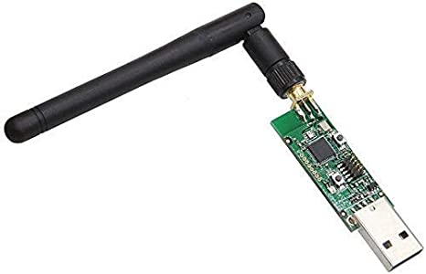

# zigbee设备接入

## zigbee通讯协议

- 短距离通讯
- 低功耗
- 低带宽

## 架构


- zigbee2mqtt官网：https://www.zigbee2mqtt.io/

## cc2531



- zigbee2mqtt支持各种zigbee dangle(adapter)
- cc2531是最常见的zigbee芯片
- zigbee dangle需要烧写固件，不同的dangle烧写固件的方法是不同的

## 烧写cc2531 zigbee dangle

有各种烧写cc2531的方法，这儿选择一种只需要树莓派+连接器的方案。

1. 安装`wiringpi`

    `sudo apt-get install wiringpi`

2. 下载烧写程序和固件

    - 烧写程序(https://github.com/jmichault/flash_cc2531.git)

        `git clone https://github.com/jmichault/flash_cc2531.git`

    - 固件(https://github.com/Koenkk/Z-Stack-firmware/raw/master/coordinator/Z-Stack_Home_1.2/bin/default/CC2531_DEFAULT_20190608.zip)

        ```
        wget https://github.com/Koenkk/Z-Stack-firmware/raw/master/coordinator/Z-Stack_Home_1.2/bin/default/CC2531_DEFAULT_20190608.zip

        unzip CC2531_DEFAULT_20190608.zip
        ```

3. 硬件连接

    ```
    cc2531 dangle           树莓派
    pin 1 (GND)     -->    pin 39 (GND)
    pin 7 (reset)   -->    pin 35
    pin 3 (DC)      -->    pin 36
    pin 4 (DD)      -->    pin 38

    pin 2           -->    pin 1 或 pin 17 (3.3v电源)
    ```


4. 烧写

- 查看芯片id

  `./cc_chipid -m 200`

- 备份

  `./cc_read save.hex -m 200`

- 擦除

  `./cc_erase -m 200`

- 烧写

  `./cc_write CC2531ZNP-Prod.hex  -m 200`

## 安装add-on `Mosquitto broker`

- 采用缺省配置，不需要做任何修改
- 使用HomeAssistant的用户名和密码进行访问

## 在HomeAssistant中配置mqtt

- 在集成界面中完成

  注意：`启用发现`需要勾选

- 在`configuration.yaml`中完成

    ```yaml
    mqtt:
      broker: 127.0.0.1
      username: HomeAssistant的用户名
      password: HomeAssistant的密码
      discovery: true
    ```

## 安装与配置add-on `Zigbee2mqtt`

- 添加仓库`https://github.com/danielwelch/hassio-zigbee2mqtt`

- 仅需要修改配置中mqtt的用户名和密码，设置为HomeAssistant的用户名和密码

- 启动前，记得将zigbee dangle插入usb口

## zigbee设备接入

- 在`zigbee2mqtt`的web界面上点击`permit join`
- 重置zigbee设备
- 设备接入后，`Disable join`

## HomeAssistant中后续的配置

- 设置实体的隐藏、名称、图标
- 在自动化中进行配置