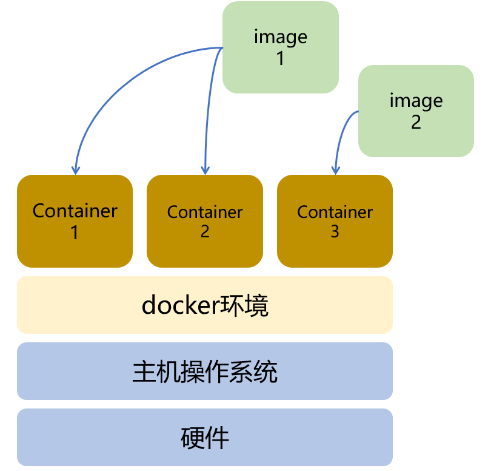

# Docker基础-上

## 操作步骤

1. 安装docker环境

    下载安装脚本：`curl -fsSL https://get.docker.com -o get-docker.sh`

    执行安装脚本：`sudo sh get-docker.sh`

    将操作用户添加入docker组：`sudo usermod -aG docker ubuntu`

    查看docker环境信息：`docker version`与`docker info`

2. docker镜像

    https://hub.docker.com/

    下载debian image最新版：`docker pull debian`

    下载python:3.5的image：`docker pull python:3.5`

    下载python image的最新版：`docker pull python`

    列出本地的image：`docker image ls`

3. docker容器

    生成容器并运行：`docker run hello-world`

    生成容器并运行时，指定容器的名字：`docker –name myapp hello-world`

    启动容器（不生成）：`docker start xxxxx`

    列出系统中的容器(1)：`docker container ls -a`

    列出系统中的容器(2)：`docker ps -a`

4.  删除容器与镜像

    删除容器：`docker rm xxxxx`

    删除镜像：`docker rmi hello-world`

## 参考
- docker命令参考

    https://docs.docker.com/engine/reference/commandline/cli/
 
